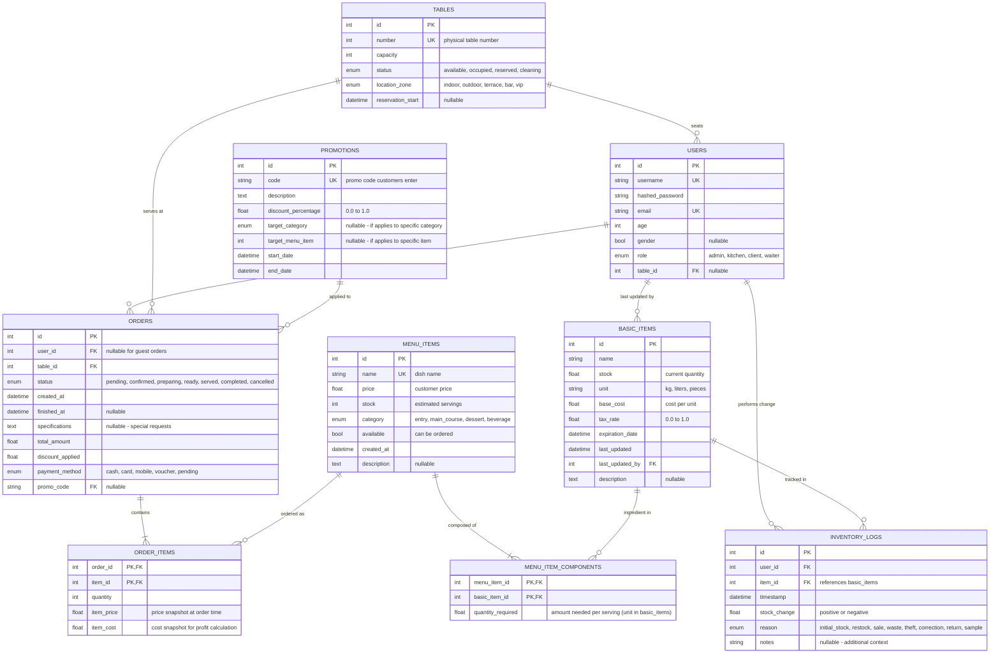

# Complete Modular FastAPI Project Guide

## 📁 Final Project Structure

```
project_root/
│
├── main.py                              # Application entry point
├── config.py                            # Configuration settings
├── requirements.txt                     # Dependencies
├── .env                                # Environment variables
├── .gitignore
│
├── core/                               # Core functionality
│   ├── __init__.py
│   ├── security.py                     # JWT, hashing, auth
│   └── dependencies.py                 # Shared dependencies
│
├── database/                           # Database layer
│   ├── __init__.py
│   ├── base.py                         # Base setup & model imports
│   ├── session.py                      # Session management
│   └── models/                         # ORM models
│       ├── __init__.py
│       ├── user.py                     # User model
│       └── item.py                     # Item model
|             ...
│
├── schemas/                            # Pydantic schemas
│   ├── __init__.py
│   ├── user.py                         # User schemas
│   └── item.py                         # Item schemas
|          ...
│
├── services/                           # Business logic
│   ├── __init__.py
│   ├── user_service.py                 # User operations
│   └── product_service.py              # Product operations
│
├── api/                                # API routes
│   ├── __init__.py
│   └── v1/                             # API version 1
│       ├── __init__.py
│       ├── router.py                   # Main v1 router
│       └── endpoints/                  # Endpoint modules
│           ├── __init__.py
│           ├── auth.py                 # Auth endpoints
│           ├── users.py                # User endpoints
│           └── items.py                # Items endpoints
|                 ...
│
└── tests/                              # Test suite
    ├── __init__.py
    ├── test_auth.py
    ├── test_products.py
    └── ...

```
---

## Database structure


---

## 🔧 Configuration Files

### `config.py`
```python
from dotenv import load_dotenv
import os
from typing import Final # So that my variables are immutable

# Load environment variables from .env file
load_dotenv(dotenv_path=".env")

# Database configuration
DATABASE_URL: Final[str] = os.getenv("DATABASE_URL", "sqlite:///./sql_app.db")

# JWT configuration
SECRET_KEY: Final[str] = os.getenv("SECRET_KEY", "your-secret-key-here")  # Change in production!
ALGORITHM: Final[str] = os.getenv("ALGORITHM", "HS256")
ACCESS_TOKEN_EXPIRE_MINUTES: Final[int] = int(os.getenv("ACCESS_TOKEN_EXPIRE_MINUTES", "30"))
TOKEN_REFRESH_THRESHOLD_MINUTES: Final[int] = int(os.getenv("TOKEN_REFRESH_THRESHOLD_MINUTES", "15"))
DEBUG: Final[bool] = os.getenv("DEBUG", "False").lower() in ("true", "1", "t", "True", "TRUE")  # Convert to boolean
```

### `.env`
```env
DATABASE_URL=sqlite:///./DATABASE.db
SECRET_KEY=sexysecret
ALGORITHM=HS256
ACCESS_TOKEN_EXPIRE_MINUTES=30
TOKEN_REFRESH_THRESHOLD_MINUTES = 15
DEBUG=True
```

### `requirements.txt`
```txt
fastapi==0.104.1
uvicorn[standard]==0.24.0
sqlalchemy==2.0.23
python-jose[cryptography]==3.3.0
passlib[bcrypt]==1.7.4
python-multipart==0.0.6
python-dotenv==1.0.0
pydantic==2.5.0
bcrypt==3.2.2
```

## 🎯 Key Benefits of This Structure

1. **Clear Separation**:
   - Models = Database structure
   - Schemas = API contracts
   - Services = Business logic
   - Endpoints = HTTP layer

2. **Easy Testing**:
   - Test services independently
   - Mock database easily
   - Test endpoints separately

3. **Scalability**:
   - Add new features without touching existing code
   - Easy to add API versioning (v2, v3)
   - Can split into microservices later

4. **Maintainability**:
   - Each file has a single responsibility
   - Easy to find and fix bugs
   - Clear dependencies


## 🏃 Running the Application Locally

```bash
# Install dependencies
pip install -r requirements.txt

# Run the server
uvicorn main:app --reload

# Access documentation
# http://localhost:8000/docs
```

## 🏃 Running the Application with Docker

```bash
docker build -t backend_api .

docker run --rm -p 8000:8000 backend_api
```

OR just click in the bat file which contains the following inside

```bash
@echo off
SET IMAGE_NAME=backend_api
SET PORT=8000

echo Building Docker image...
docker build -t %IMAGE_NAME% .

IF %ERRORLEVEL% NEQ 0 (
    echo Docker build failed. Exiting.
    exit /b 1
)

echo Running Docker container...
docker run --rm -p %PORT%:%PORT% %IMAGE_NAME%

pause
```

## 🔒 Security Notes

- Change `SECRET_KEY` in production
- Use environment variables for sensitive data
- Consider using PostgreSQL in production if the place is too big
- Add rate limiting for production 
- Implement proper CORS settings
- Add input validation
- Use HTTPS in production
