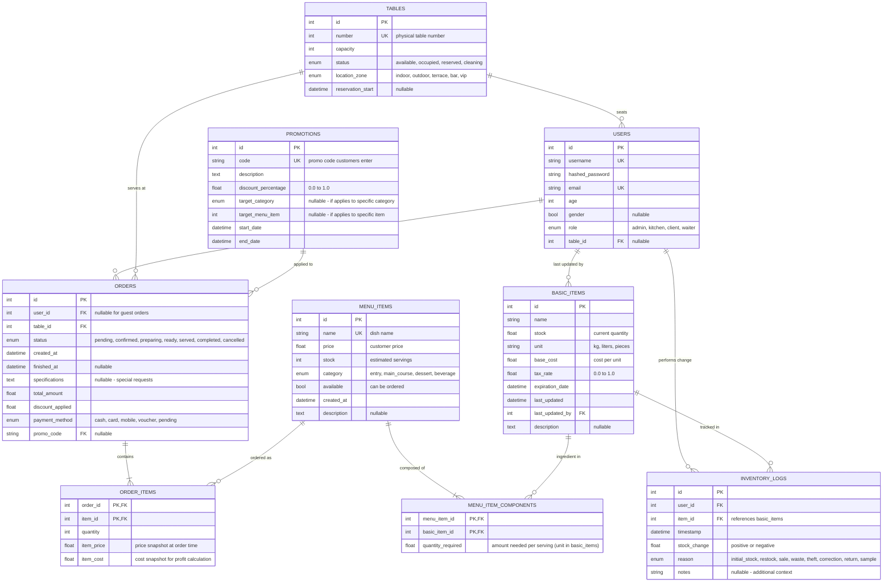

# ⚙️ ZeCo Backend

The backend API for the ZeCo Restaurant Management System. It is built using **FastAPI** for high performance and **SQLAlchemy** for robust database interactions.

## 🧠 Project Concept & Architecture

The backend follows a **Modular Service-Layer Architecture**. This separates concerns to make the code clean, testable, and scalable.

### Key Architectural Layers:
1.  **API Layer (`api/`)**: Handles HTTP requests, input validation, and routing. It should contain *no business logic*, only request handling.
2.  **Service Layer (`services/`)**: Contains the actual "business logic" (e.g., "Calculate total price", "Check inventory"). It interacts with the database.
3.  **Data Layer (`database/` & `models/`)**: Defines the database structure (tables) and handles raw SQL queries via the ORM.
4.  **Schemas (`schemas/`)**: Defines the data format for inputs (Pydantic models). This ensures that data entering the API is valid.

## 📂 Detailed Folder Structure

```
backend/
├── 📂 api/                     # The Interface Layer (Routes)
│   └── v1/                     # API Versioning (v1, v2, etc.)
│       ├── endpoints/          # Specific route handlers
│       │   ├── auth.py         # Login & Registration endpoints
│       │   ├── users.py        # User management endpoints
│       │   └── products.py     # Menu item endpoints
│       └── router.py           # Aggregates all endpoints
│
├── 📂 core/                    # Core Configuration & Security
│   ├── config.py               # Loads settings from .env
│   ├── security.py             # JWT generation, Password hashing
│   └── dependencies.py         # Shared dependencies (e.g., "get_current_user")
│
├── 📂 database/                # The Persistence Layer
│   ├── models/                 # SQLAlchemy Classes (The "Truth" of the DB)
│   │   ├── user.py             # User table definition
│   │   └── product.py          # Product/Menu table definition
│   ├── session.py              # Database connection logic
│   └── base.py                 # Imports all models for Alembic/Init
│
├── 📂 schemas/                 # Data Validation (Pydantic)
│   ├── user.py                 # Rules for user input/output
│   └── product.py              # Rules for product input/output
│
├── 📂 services/                # The Business Logic Layer
│   ├── user_service.py         # Logic for creating/managing users
│   └── product_service.py      # Logic for inventory and menu management
│
├── main.py                     # Application Entry Point
└── DATABASE.db                 # SQLite Database File (Persisted)
```

## 🗄️ Database Structure (ER Diagram)

The database is designed to handle users, menu items, orders, and inventory.


```mermaid
erDiagram
    USERS {
        int id PK
        string username UK
        string hashed_password
        string email UK
        int age
        bool gender "nullable"
        enum role "admin, kitchen, client, waiter"
        int table_id FK "nullable"
    }

    TABLES {
        int id PK
        int number UK "physical table number"
        int capacity
        enum status "available, occupied, reserved, cleaning"
        enum location_zone "indoor, outdoor, terrace, bar, vip"
        datetime reservation_start "nullable"
    }

    BASIC_ITEMS {
        int id PK
        string name
        float stock "current quantity"
        string unit "kg, liters, pieces"
        float base_cost "cost per unit"
        float tax_rate "0.0 to 1.0"
        datetime expiration_date
        datetime last_updated
        int last_updated_by FK
        text description "nullable"
    }

    MENU_ITEMS {
        int id PK
        string name UK "dish name"
        float price "customer price"
        int stock "estimated servings"
        enum category "entry, main_course, dessert, beverage"
        bool available "can be ordered"
        datetime created_at
        text description "nullable"
    }

    MENU_ITEM_COMPONENTS {
        int menu_item_id PK,FK
        int basic_item_id PK,FK
        float quantity_required "amount needed per serving (unit in basic_items)"
    }

    ORDERS {
        int id PK
        int user_id FK "nullable for guest orders"
        int table_id FK
        enum status "pending, confirmed, preparing, ready, served, completed, cancelled"
        datetime created_at
        datetime finished_at "nullable"
        text specifications "nullable - special requests"
        float total_amount
        float discount_applied
        enum payment_method "cash, card, mobile, voucher, pending"
        string promo_code FK "nullable"
    }

    ORDER_ITEMS {
        int order_id PK,FK
        int item_id PK,FK
        int quantity
        float item_price "price snapshot at order time"
        float item_cost "cost snapshot for profit calculation"
    }

    PROMOTIONS {
        int id PK
        string code UK "promo code customers enter"
        text description
        float discount_percentage "0.0 to 1.0"
        enum target_category "nullable - if applies to specific category"
        int target_menu_item "nullable - if applies to specific item"
        datetime start_date
        datetime end_date
    }

    INVENTORY_LOGS {
        int id PK
        int user_id FK
        int item_id FK "references basic_items"
        datetime timestamp
        float stock_change "positive or negative"
        enum reason "initial_stock, restock, sale, waste, theft, correction, return, sample"
        string notes "nullable - additional context"
    }

    %% Core Relationships
    USERS ||--o{ ORDERS : "places/manages"
    TABLES ||--o{ USERS : "seats"
    TABLES ||--o{ ORDERS : "serves at"
    
    %% Order Structure
    ORDERS ||--|{ ORDER_ITEMS : "contains"
    MENU_ITEMS ||--o{ ORDER_ITEMS : "ordered as"
    
    %% Menu Composition (Recipe)
    MENU_ITEMS ||--|{ MENU_ITEM_COMPONENTS : "composed of"
    BASIC_ITEMS ||--o{ MENU_ITEM_COMPONENTS : "ingredient in"
    
    %% Inventory Management
    USERS ||--o{ BASIC_ITEMS : "last updated by"
    USERS ||--o{ INVENTORY_LOGS : "performs change"
    BASIC_ITEMS ||--o{ INVENTORY_LOGS : "tracked in"
    
    %% Promotions
    PROMOTIONS ||--o{ ORDERS : "applied to"
```

## 🚀 Key Features

*   **FastAPI:** Automatic interactive documentation (Swagger UI) at `/docs`.
*   **SQLite:** Zero-configuration database, perfect for this scale.
*   **JWT Authentication:** Secure, stateless authentication using JSON Web Tokens.
*   **Dependency Injection:** FastAPI's DI system is used for database sessions and current user retrieval.

## 🛠️ Development Commands

```bash
# Create virtual environment
python -m venv venv
source venv/bin/activate  # Windows: venv\Scripts\activate

# Install dependencies
pip install -r requirements.txt

# Run server with hot-reload
uvicorn main:app --reload
```

## Notes 

- Implement proper CORS settings
- Implement proper logging (i18n)
- Implement proper error handling
